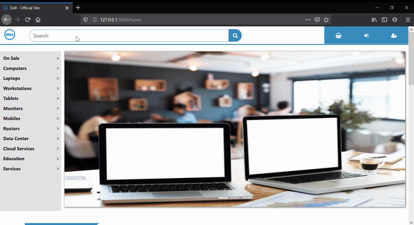

# Ad-Based-Product-Recommendation-System

> Personalized recommendations based on User Activity Tracking

* Ad - Based Product Recommendation System works dynamically using the input details,  website visitation behavior and likes and dislikes of the user. These inputs determine advertisement placement and presentation. 

* It can recommend products having similar prices and specifications. It also has the ability to recommend those complementary products which are commonly purchased along with the product that is currently in cart similar to the People who bought this also bought system present on Flipkart and Amazon.

* In this project, I've tried to implement a smaller version of the Ad System used by Amazon in which an Ad appears on a random shopping website and if the user clicks on that Ad then he/she is redirected to our website where we provide recommendations based on user's activity on the previous website. 

* This system can provide personalized recommendations that can help the user get the best product and the company more revenue.

